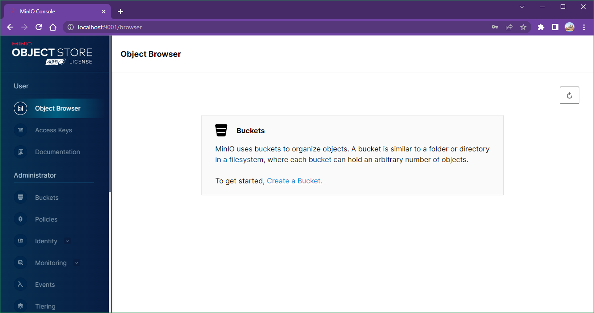

# Lab 012: Backup Vault in Minio

Windows Only (with Docker)

## Lab Goal

In this lab, we will deploy a helm chart with a cronjob to backup vault periodically into the Minio storage

## Prerequisites

### 1. Install and run Docker for Windows

### 2. Install Minikube for Windows

### 3. Start Minikube

`minikube start`

<!--
or

`minikube start --kubernetes-version=v1.26.1`
-->

### 4. Install kubectl for Windows

```dos
minikube kubectl
```

Verify with `kubectl get node`

```dos
NAME       STATUS   ROLES           AGE     VERSION
minikube   Ready    control-plane   4m37s   v1.25.3
```

### 5. Install Helm for Windows

```dos
choco install kubernetes-helm
```

## Steps

### 1. Enable Minikube Dashboard (Optional)

We can also enable our **Minikube dashboard** by running below command:

```dos
minikube dashboard
```

We should see a Kuberentes Dashboard page pop out in our browser immediately.

We can explore all Minikube resources in this UI website.

### 2. Add Helm Repo

```dos
helm repo add minio https://charts.min.io/
```

### 3. Create a namespace

Create a `minio` namespace

```dos
kubectl create ns minio

kubectl config set-context --current --namespace=minio
```

### 4. Install Minio Helm Chart

Since we are using Minikube cluster which has only 1 node, we just deploy the Minio in a test mode.

<!--
The latest version of minio has issues! Wasted my long long time!

```dos
helm install --set resources.requests.memory=512Mi --set replicas=1 --set mode=standalone --set rootUser=rootuser,rootPassword=Test1234! --generate-name minio/minio
```
-->

<!--
helm search repo minio/minio -l

minio/minio     5.0.8           RELEASE.2023-04-13T03-08-07Z    Multi-Cloud Object Storage
minio/minio     5.0.7           RELEASE.2023-02-10T18-48-39Z    Multi-Cloud Object Storage
minio/minio     5.0.6           RELEASE.2023-02-10T18-48-39Z    Multi-Cloud Object Storage
minio/minio     5.0.5           RELEASE.2023-01-31T02-24-19Z    Multi-Cloud Object Storage
minio/minio     5.0.4           RELEASE.2022-12-12T19-27-27Z    Multi-Cloud Object Storage
minio/minio     5.0.3           RELEASE.2022-12-12T19-27-27Z    Multi-Cloud Object Storage
minio/minio     5.0.2           RELEASE.2022-12-12T19-27-27Z    Multi-Cloud Object Storage
minio/minio     5.0.1           RELEASE.2022-11-11T03-44-20Z    Multi-Cloud Object Storage
minio/minio     5.0.0           RELEASE.2022-10-24T18-35-07Z    Multi-Cloud Object Storage

helm install --set resources.requests.memory=512Mi --set replicas=1 --set mode=standalone --set rootUser=rootuser,rootPassword=Test1234! --generate-name --namespace=minio minio/minio --version 5.0.0
-->

```dos
helm install --set resources.requests.memory=512Mi --set replicas=1 --set mode=standalone --set rootUser=rootuser,rootPassword=Test1234! --generate-name --namespace=minio minio/minio --version 5.0.7
```

### 5. Update the configure file

Update the minio username and password in `vault-backup-values.yaml`

```bash
MINIO_USERNAME=$(kubectl get secret -l app=minio -o=jsonpath="{.items[0].data.rootUser}"|base64 -d)

echo "MINIO_USERNAME is $MINIO_USERNAME"

MINIO_PASSWORD=$(kubectl get secret -l app=minio -o=jsonpath="{.items[0].data.rootPassword}"|base64 -d)

echo "MINIO_PASSWORD is $MINIO_PASSWORD"
```

Check the minio service name and update the `MINIO_ADDR` env var in the `vault-backup-values.yaml` file.

```bash
MINIO_SERVICE_NAME=$(kubectl get svc -n minio -o=jsonpath={.items[0].metadata.name})

echo Minio service name is $MINIO_SERVICE_NAME
```

<!--
```bash
POD_NAME = kubectl get pods --namespace default -l "release=minio-1681481654" -o jsonpath="{.items[0].metadata.name}"
echo "Minio POD name is $POD_NAME"
kubectl port-forward $POD_NAME 9000 --namespace default
```
-->

### 6. Create a Bucket in the Minio Console

In order to access the Minio console, we need to port forward it to our local.

```bash
kubectl port-forward svc/$(kubectl get svc|grep console|awk '{print $1}') 9001:9001
```

Open our browser and go to this URL [http://localhost:9001](http://localhost:9001), and login with the username/password as `rootUser`/`rootPassword` setup above.

Go to *Buckets* section in the left lane and click *Create Bucket* with a name `test`, with all other setting as default.




<!--

-->

### 7. Install Vault Helm Chart

We are going to deploy a Vault helm chart in the Minikube cluster. Create a `vault-values.yaml` first:

```dos
cat <<EOF > vault-values.yaml

injector:
  enabled: "-"
  replicas: 1
  image:
    repository: "hashicorp/vault-k8s"
    tag: "1.1.0"

server:
  enabled: "-"
  image:
    repository: "hashicorp/vault"
    tag: "1.12.1"
EOF
```

Run below commands to apply the helm chart:

```dos
helm repo add hashicorp https://helm.releases.hashicorp.com

kubectl create ns vault-test

kubectl config set-context --current --namespace=vault-test

helm -n vault-test install vault hashicorp/vault -f vault-values.yaml
```

Initiate the Vault

```dos
kubectl -n vault-test exec vault-0 -- vault operator init

kubectl -n vault-test exec vault-0 -- vault operator unseal <unseal key from .vault.key>
kubectl -n vault-test exec vault-0 -- vault operator unseal <unseal key from .vault.key>
kubectl -n vault-test exec vault-0 -- vault operator unseal <unseal key from .vault.key>

# Enable secrets engine and import config

kubectl -n vault-test exec vault-0 -- vault login <root token>

kubectl -n vault-test exec vault-0 -- vault secrets enable -version=2 kv-v2 

kubectl -n vault-test exec vault-0 -- vault kv put -mount=kv-v2 devops-secret username=root password=changeme

# Enable approle engine and create role/secret

kubectl -n vault-test exec -it vault-0 -- sh

cd /tmp

cat > policy.hcl  <<EOF
path "kv-v2/*" {
  capabilities = ["create", "update","read"]
}
EOF

vault policy write first-policy policy.hcl

vault policy list

vault policy read first-policy

vault auth enable approle

vault write auth/approle/role/first-role \
    secret_id_ttl=10000m \
    token_num_uses=10 \
    token_ttl=20000m \
    token_max_ttl=30000m \
    secret_id_num_uses=40 \
    token_policies=first-policy

export ROLE_ID="$(vault read -field=role_id auth/approle/role/first-role/role-id)"

echo Role_ID is $ROLE_ID

export SECRET_ID="$(vault write -f -field=secret_id auth/approle/role/first-role/secret-id)"

echo SECRET_ID is $SECRET_ID
```

### 8. Allow minio namespace to access valut-test namespace

`kubectl apply -f network-policy.yaml`

### 9. Deploy Vault Backup Helm Chart

```dos
kubectl -n vault-test create configmap upload --from-file=upload.sh

helm -n vault-test upgrade --install vault-backup helm-chart -f vault-backup-values.yaml

kubectl -n vault-test create job vault-backup-test --from=cronjob/vault-backup-cronjob
```

### 10. Verification

Port forward Minio console to our local host:

```dos
MINIO_CONSOLE_ADDR=$(kubectl -n minio get svc|grep console|awk '{print $1}')

kubectl -n minio port-forward svc/$MINIO_CONSOLE_ADDR 9001:9001
```

Login to the Minio console [http://localhost:9001](http://localhost:9001) and go to **Object Browser** section in the left navigation lane. Click **Test** bucket and we should see the backup files list there.


<!--
Reference

[Minio Helm Deployment](https://github.com/minio/minio/tree/master/helm/minio)

git clone https://github.com/briansu2004/udemy-devops-14-real-projects.git
cd udemy-devops-14-real-projects/012-CronjobVaultBackupHelmMinikube
-->

<!--
Initial Root Token: hvs.5vozFxJg1ZTLv39r8Y8LnlBd

/tmp $ echo Role_ID is $ROLE_ID
Role_ID is a813c0c9-b485-c546-6764-ce34603cd8d6
/tmp $
/tmp $ echo SECRET_ID is $SECRET_ID
SECRET_ID is a131ca8c-b72c-bd87-ca65-e2e0ed689ed7

kubectl -n vault-test port-forward svc/vault 8200:8200

http://localhost:8200
-->

<!--
Minio service name is minio-1681526507

Unseal Key 1: LnnYzJ1CfL528g0x8uGh7iP7kXNIcV/4i8SMxFwR/znN
Unseal Key 2: A3KtnJ+82H6yKWWN6FRe2mUWkQBE39DquAOsFBYIXTsa
Unseal Key 3: 92fAm1M2TcuQf1w3lwXiaP/Do9j7fj1cK//jLs3Hlz8v
Unseal Key 4: +eKioNOpB5Nqc4E6P4/vVXnnIZ3EMGtY0ODCektEfIGb
Unseal Key 5: wmWWXGtmrDEcfmQYW+62AIfDXe3pEgxW4kE+Qnvdz9Lv

Initial Root Token: hvs.yHwL13u8pCy7oxIfrKvTyNtM

Role_ID is cc96ed8c-e5e4-a055-bee4-5a6c59840e73
SECRET_ID is 559c94a4-4374-7fc1-c6cf-3b22912db51d


-->