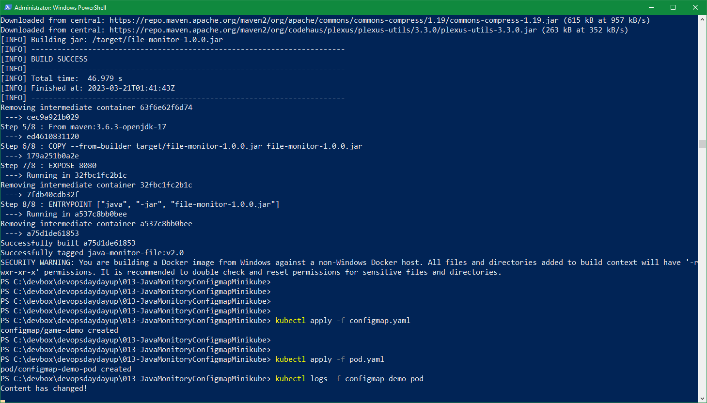

# Lab 013: Develop a Java Application in Kubernetes for Monitoring ConfigMap Modifications and Content Changes

Windows Only

## Lab Goal

In this lab, we will learn how to develop a **Java application** that interacts with the Kubernetes API to **monitor changes** to a file that is mounted by a **ConfigMap**.

## Steps

### 1. Start Docker

Minikube needs Docker.

### 2. Start Minikube

You can install the **Minikube** by following the instruction in the [Minikube official website](https://minikube.sigs.k8s.io/docs/start/).

Once it is installed, start the minikube by running below command:

```dos
minikube start
minikube status
```

Once the Minikube starts, you can download the **kubectl** from [k8s official website](https://kubernetes.io/docs/tasks/tools/)

```dos
minikube kubectl
```

Then, when you run the command `kubectl get node`, you should see below output:

```dos
NAME       STATUS   ROLES           AGE     VERSION
minikube   Ready    control-plane   2d4h   v1.26.1
```

### 3. Build Image

Run below command to **build** the image:

```dos
git clone https://github.com/briansu2004/udemy-devops-14-real-projects.git
cd udemy-devops-14-real-projects\013-JavaMonitoryConfigmapMinikube
docker build -t java-monitor-file:v2.0 .
```

### 4. Deploy ConfigMap

```dos
kubectl apply -f configmap.yaml
```

### 5. Deploy Pod

```dos
kubectl apply -f pod.yaml
```

### 6. Verification

You can modify the contents of the ConfigMap and verify if the activity is captured in the log.

First **stream the log**

```dos
kubectl logs -f configmap-demo-pod
```

Then open another terminal to **modify the ConfigMap**

```dos
kubectl edit cm game-demo
```

**Update** anything within below **data** section

e.g.

From

```dos
data:
  game.properties: "enemy.types=aliens,monsters\nplayer.maximum-lives=5\\n"
```

To

```dos
data:
  game.properties: "enemy.types=alienstest,monsters\nplayer.maximum-lives=5\\n"
```


->


Then wait for about 1 min and you should see below message in the log

```dos
kubectl logs -f configmap-demo-pod
```

The content been has changed!


